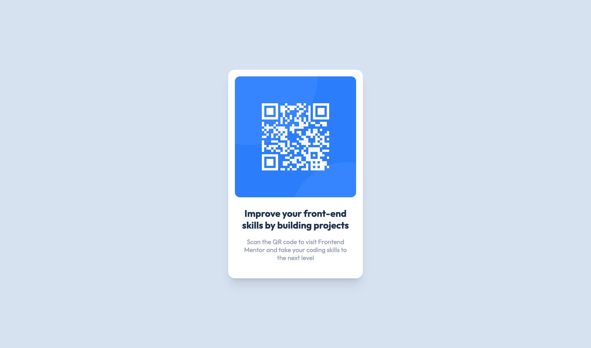

# Frontend Mentor - QR code component solution

## Table of contents

- [Overview](#overview)
  - [Preview](#preview)
  - [Links](#links)
- [My process](#my-process)
  - [Built with](#built-with)
  - [What I learned](#what-i-learned)

## Overview

### Preview

### Links

- Live Site URL: [Demo](https://thomasspradling.github.io/FEM-qr-code-component/dist/)
- Link to Solution: [FEM Solution](https://www.frontendmentor.io/challenges/qr-code-component-iux_sIO_H/hub)
- Try it yourself: [QR code component challenge](https://www.frontendmentor.io/challenges/qr-code-component-iux_sIO_H)

## My process

### Built with

- Semantic HTML5 markup
- [Tailwind CSS](https://tailwindcss.com/)

### What I learned

This was a good introduction to design——an area web development that I am not as good with. Going from design to CSS sometimes is challenging, and getting a handle of this has been great. I am fairly new to Tailwind, so I am trying to pick up tricks along the way with that too.
